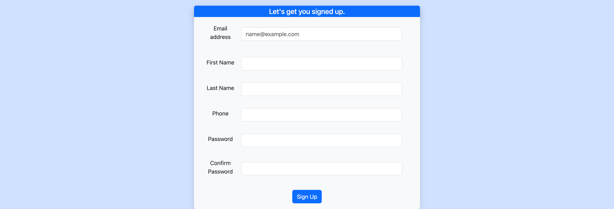
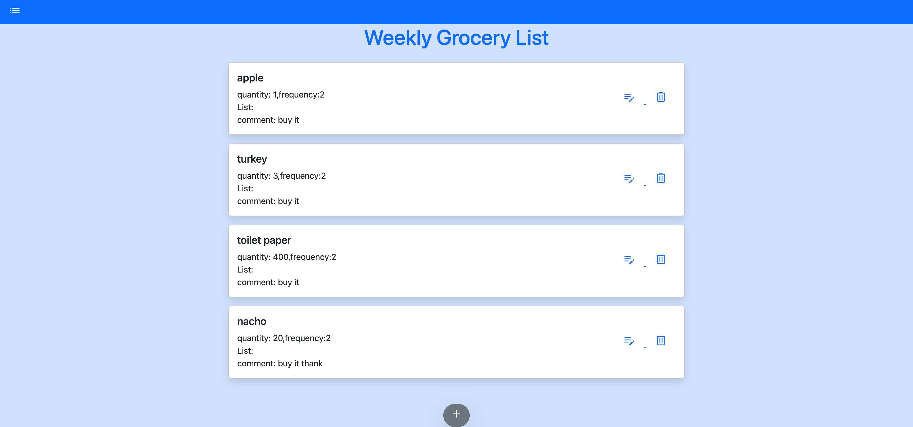
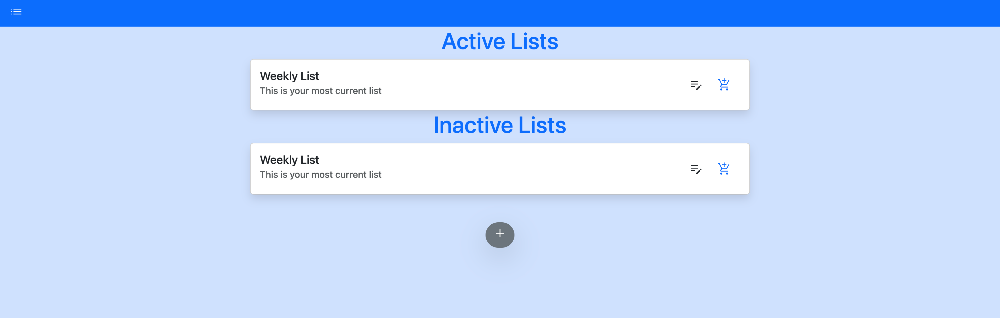

# Project 2
Group 1: Lantao Zhang, Joe Hanson, Madison Woodward, Hannah Vaughan

## Description
This is a simple grocery list application that allows users to keep track of their grocery lists. When the user opens the app, they are presented with a login screen. If the user has credentials, they enter in their username and password and press the login button. If these are not the correct credentials, then nothing will occur. If they match the values in the database, then the user is taken to their current grocery list page for that week. If the user does not have an account made, they press the sign up button and are redirected to a signup page to input their information and create an account. Once the user is in their account, they have a current grocery list page, and a page with their active and inactive lists. The user is able to input the grocery item needed, quantity, and any additional comments, and also able to delete, edit, and add items. 

## Technologies Used
JavaScript,  Handlebars, CSS, Node.js, Express.js, Sequelize, mySQL, Twilio, bcrypt, DotENV

## Visuals/Screenshots

## Deployed App
Deployed app URL: https://mvp-grocery-list.herokuapp.com/home/
